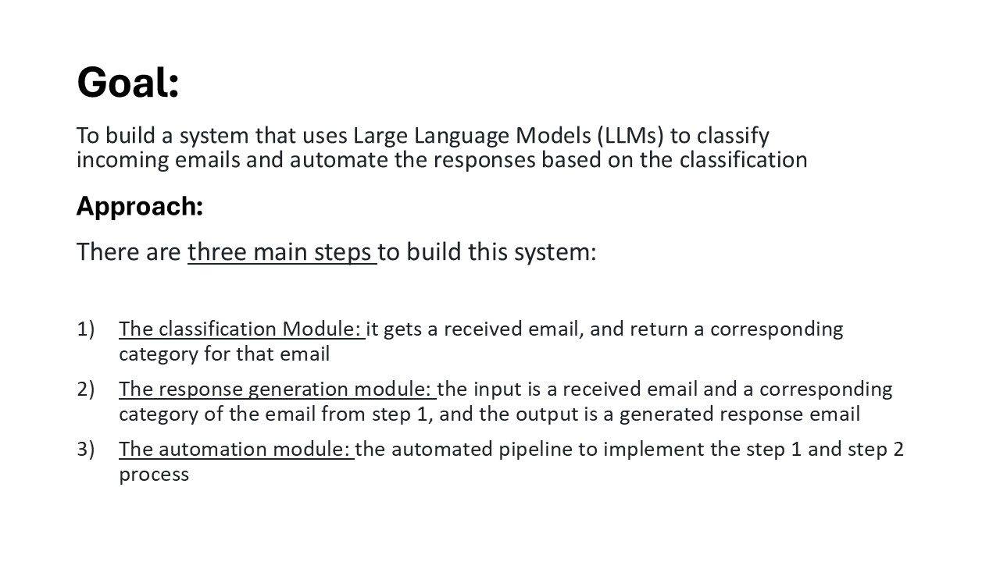
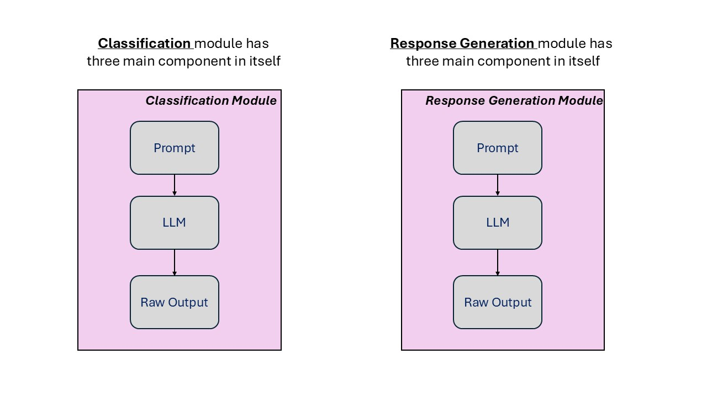
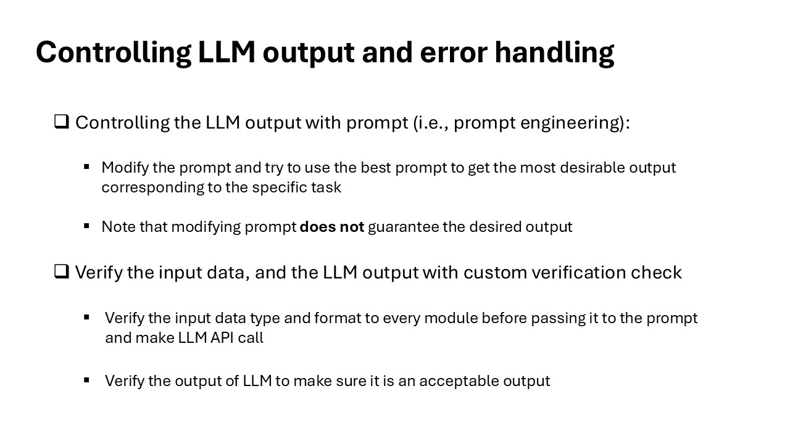
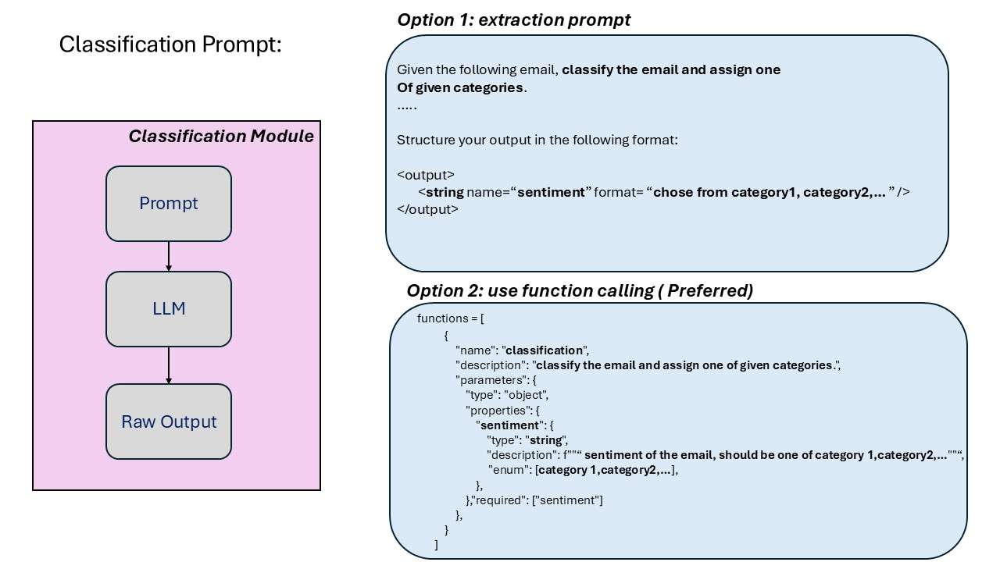
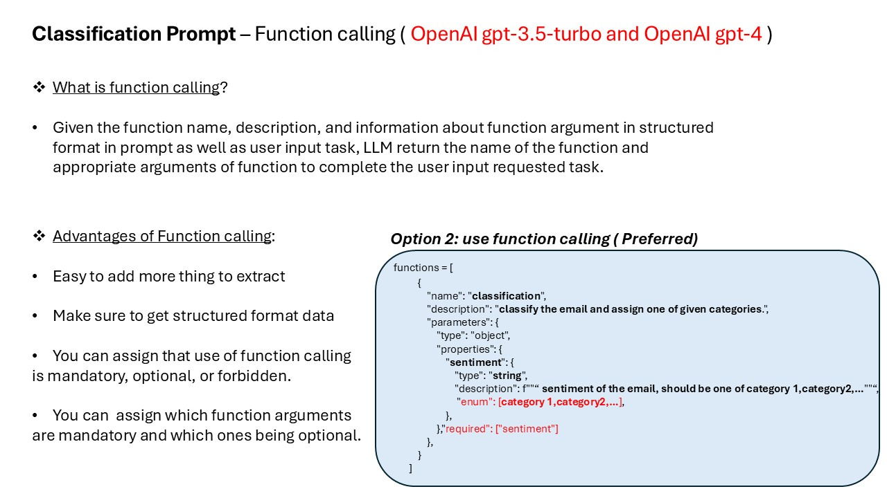
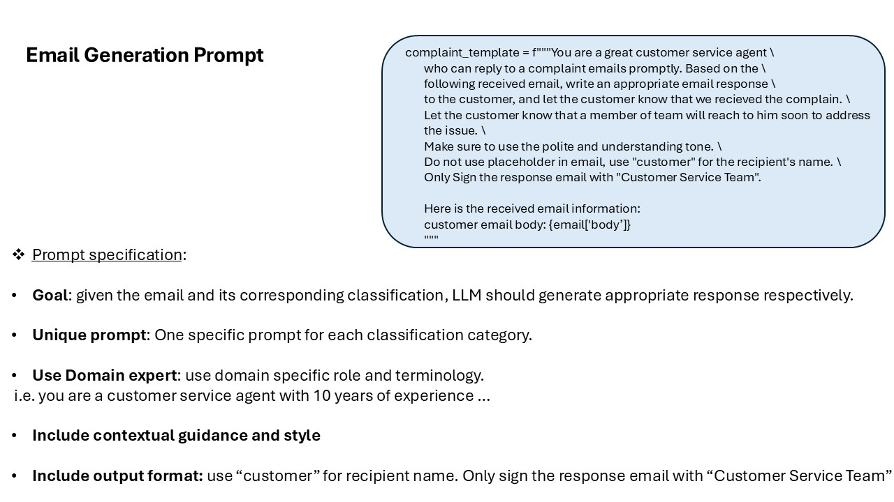
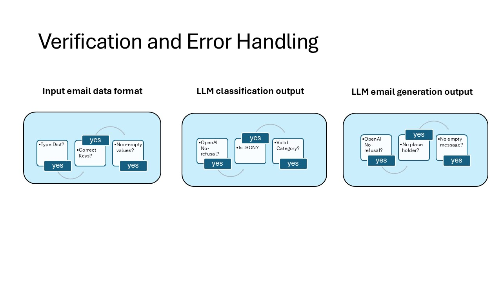
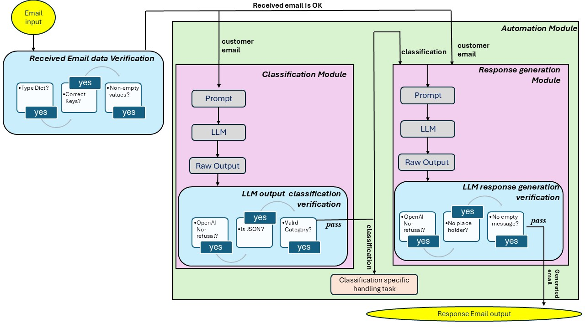

# llm-email-classifier-completed
System that uses Large Language Models (LLMs) to classify incoming emails and automate responses based on the classification

   

   

   

   

   

   

   

   

   

   

